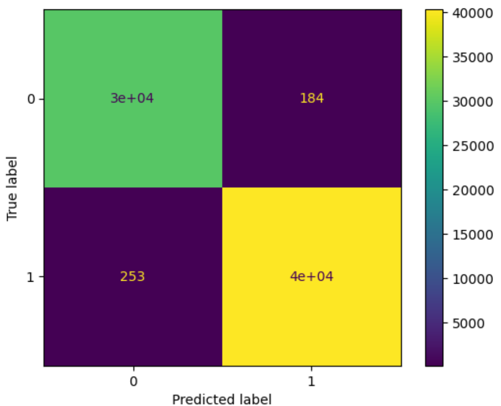
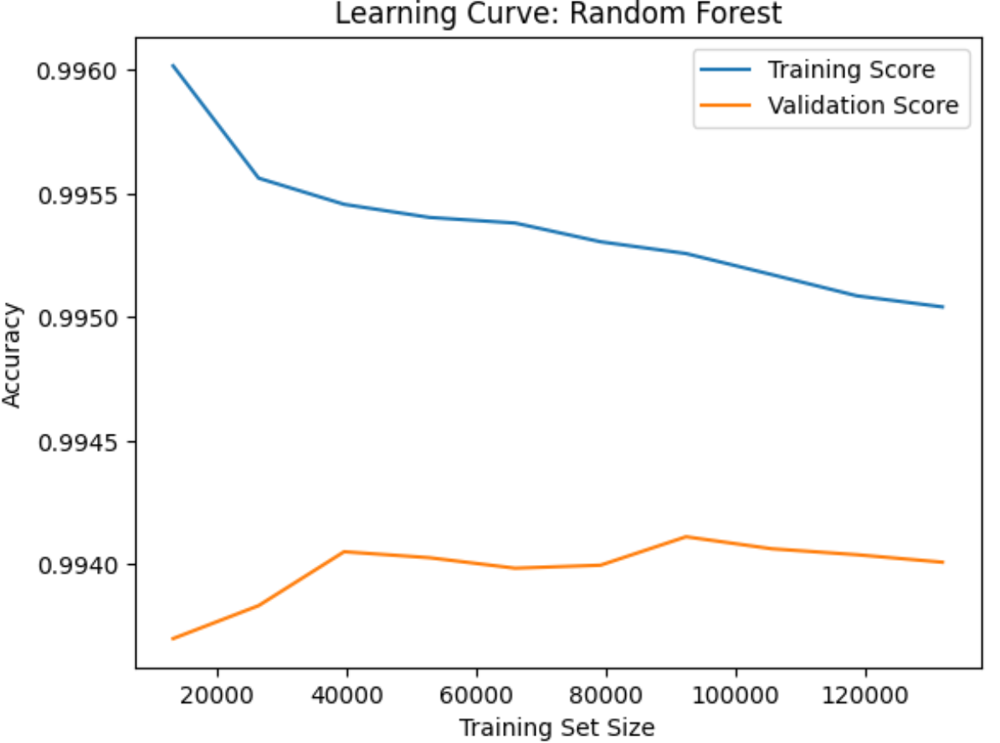

# Phishing and Legitimate URL Detection

**Dataset**: [Kaggle - Phishing URL Dataset](https://www.kaggle.com/datasets/ndarvind/phiusiil-phishing-url-dataset)  
**Introductory Paper**: [ScienceDirect Article](https://www.sciencedirect.com/science/article/abs/pii/S0167404823004558)

## Dataset Information

This project uses a dataset containing over 235,795 labeled URLs, where label `0` indicates a phishing URL and label `1` indicates a legitimate one. The dataset includes over 49 extracted features (from a total of 55 columns) that capture the structural, lexical, and statistical characteristics of URLs. One unique feature in this dataset is the **URL Similarity Index (USI)**, which is highly correlated and domain-specific.

## Model Design Approach

The dataset was already clean and well-prepared, eliminating the need for further preprocessing. No additional feature engineering was necessary, as the included features were already rich and informative. Exploratory Data Analysis (EDA) was conducted to understand feature distributions and detect redundancy or low-importance columns. Some features were removed based on EDA insights and importance metrics.

The dataset was then split into 70% training and 30% testing subsets. Importantly, the USI feature was purposely removed during training to avoid inflated performance and to ensure the model generalizes well in real-world settings.

Tree-based models were explored for classification, with **Random Forest** outperforming others in both accuracy and generalization. Additional improvements were made using hyperparameter tuning and probability threshold adjustments.

## Results
Training Accuracy: 0.9949  
Testing Accuracy: 0.9938 

<h4>Testing Classification Report</h4>

<table>
  <thead>
    <tr>
      <th>Class</th>
      <th>Precision</th>
      <th>Recall</th>
      <th>F1-Score</th>
      <th>Support</th>
    </tr>
  </thead>
  <tbody>
    <tr>
      <td>0</td>
      <td>0.9916</td>
      <td>0.9939</td>
      <td>0.9928</td>
      <td>30,151</td>
    </tr>
    <tr>
      <td>1</td>
      <td>0.9955</td>
      <td>0.9938</td>
      <td>0.9946</td>
      <td>40,588</td>
    </tr>
  </tbody>
</table>

<table>
  <thead>
    <tr>
      <th>Metric</th>
      <th>Precision</th>
      <th>Recall</th>
      <th>F1-Score</th>
      <th>Support</th>
    </tr>
  </thead>
  <tbody>
    <tr>
      <td>Accuracy</td>
      <td></td>
      <td></td>
      <td>0.9938</td>
      <td>70,739</td>
    </tr>
    <tr>
      <td>Macro Avg</td>
      <td>0.9935</td>
      <td>0.9938</td>
      <td>0.9937</td>
      <td>70,739</td>
    </tr>
    <tr>
      <td>Weighted Avg</td>
      <td>0.9938</td>
      <td>0.9938</td>
      <td>0.9938</td>
      <td>70,739</td>
    </tr>
  </tbody>
</table>

  

### Enjoyed this repo? A ⭐ lets me know it was worth sharing!